# Project-1: US Banks & IShare ETF Financial Analysis
### Group 2: Katie Nieuwhof, Catherine Ding, Sobi Iyver, Justice Bangura

## Motivation & Hypothesis
**Hypothesis**: we believe that certain economic environment impacts the banks financial and market behavior in US free trade market. 

We assume that:

1.	The Top 3 US Banks stock data and their financial report, as well as with iShares S&P U.S. Banks UCITS ETF data can represent the US publicly traded Banks market.
2.	The most important economic environment factors for US banks market can be briefly assessed by fed and treasury bonds interests, inflation forward rate, mortgage rates, cpi, and unemployment rate.
   
**The primary question we asked is:**
How did the US publicly traded Banks market behave during the last 5 years (2019-2023) based on the recent economic environment?

We asked this question because we have experienced a special period over the last 5 years due to Covid-19 and huge interest rate changes.

We were able to answer the above question by analyzing the relationship between the bank stock prices, the financial data, the economic data, and the banks index. We chose the top 3 US publicly traded banks - JP Morgan Chase, Bank of America, and Wells Fargo - and analyzed their stock price behaviors, 3 years of their recent financial data from their annual reports, and we compared them to one another. We also compared the data with iShares S&P U.S. Banks UCITS ETF price data and analyzed the economic data (such as fed and treasury bonds interest rates, forward inflation rate, cpi, unemployment rate, fixed mortgage rate) to assess their impacts to the banks stock market.

**The data we used, and where we found it:**
* Stock prices for JPM, BAC, and WFC were found using Google Finance function in excel sheets, and their financial data found using yahoo finance api
* IShare US Bank ETF Index data found by yahoo finance api
* Economic market data found online via New York Stock Exchange

## Findings

### Stock Price Data Findings:

**Question:** How has the bank market fluctuated over the past 5 years (2019-2023), and why?

After calculating the daily returns, we were able to calculate the cumulative returns which is displayed in the plot below. We can see a rapid decline in the cumulative returns for the top 3 US banks as well as the bank index in 2020 with the onset of COVID-19. This is likely due to the instability and high volatility the market faced during the pandemic, as well as the drastic increase in unemployment rates which negatively impacts bank profitability. The cumulative returns for the top 3 US banks and the bank index steadily increase and peak in 2022 – likely due to rapid increase of fed interest rates in 2022. Thereafter, cumulative returns decline over the first half of 2022, then remaining stable through the end of 2023. 

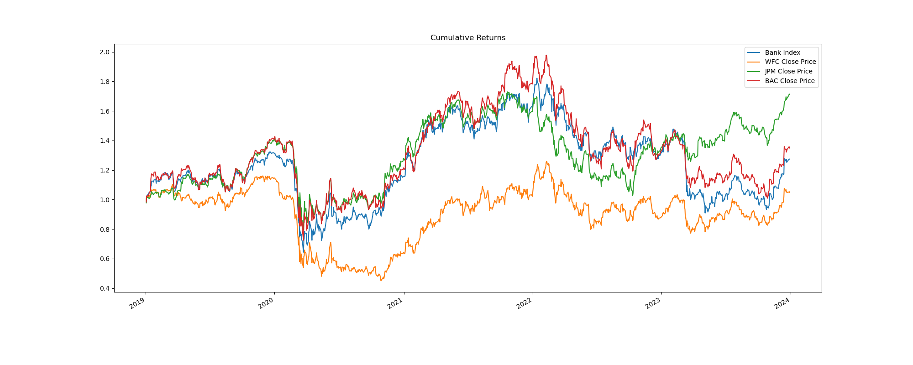

The plot below displays the rolling standard deviation with a window of 21 days. The largest change in standard deviation occurs in 2020 with the onset of COVID-19. This drastic increase implies a greater fluctuation in bank stock prices indicating a higher volatility and greater risk – which aligns with the cumulative returns plot shown above (rapid decrease in cumulative returns in 2020).

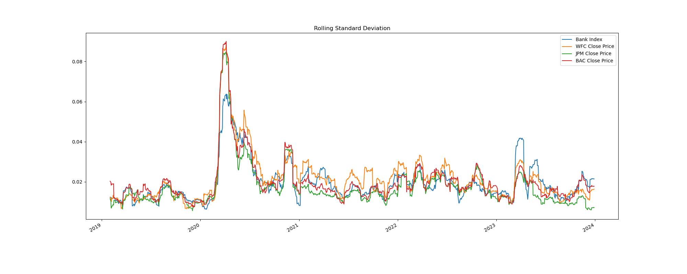

**Question:** How are do the 3 top US banks compare to each another and the bank index?

The heatmap below displays the correlation of the top 3 US bank stock prices with the bank index. This heat map demonstrates that JP Morgan Chase and Bank of America are the most correlated amongst the 4, which is not a surprise given they are the top 2 banks in the US. 

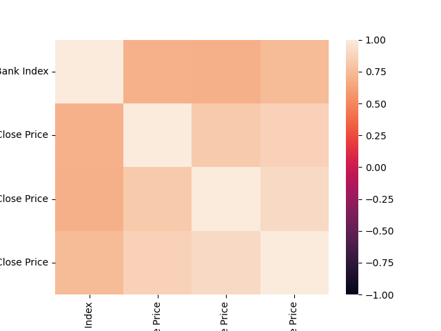

The distribution plot is based off of daily returns, and it appears all 3 banks and the index are relatively normally distributed.

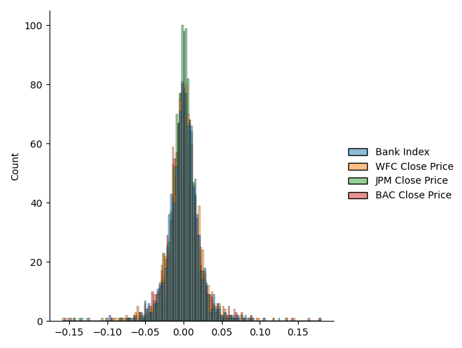

According to the Sharpe ratios shown below, JPMorgan Chase has a more attractive risk reward trade off compared to the other banks and the bank index, indicating a greater return at a lower risk. 

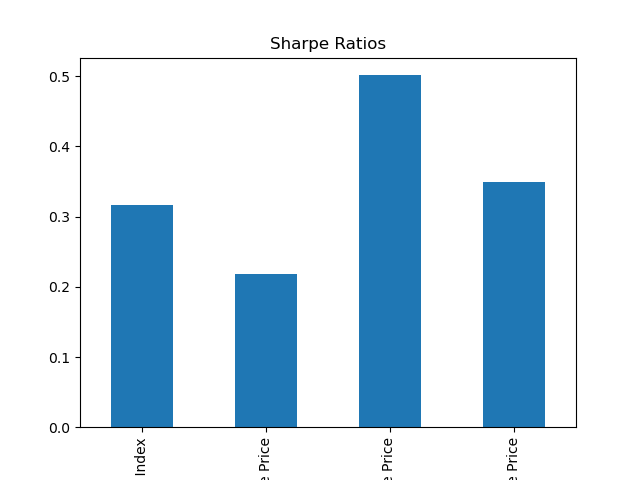

### Economic Environment Analysis

**Question:** How does the 10 Year Treasury Bond and Fed Funds interest rate with 5 year forward inflation rate behave during 2019-2023? Are they correlated with each other?

Figure 2019-2023 Interest Rates and Inflation forward rates behaviour:
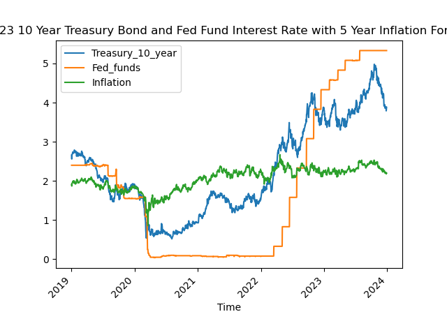 

The above plot shows that inflation dropped signicantly when Covid started in Feb 2020 and maintained low, then Fed decreased the Fed Funds Interest Rate to almost 0 to bring up the inflation. However, the 5 year forward inflation rate continued rising since 2021 while the fed fund interest rate remainded very low. The 10 year treasury bond interest is growing to maintain the 5 year forward inflation rate in a relatively stable level until the fed fund interest rate starts to grow rapidly by Fed since early 2022, while the 5 year forward inflation rate remains stable but slightly higher level than pre-Covid period. Until the most recent increase of Fed Fund Interest, the inflation rate gradualy starts to drop since the end of 2023.

From the correlation heatmap between interest rates and 5 year inflation forward rate:
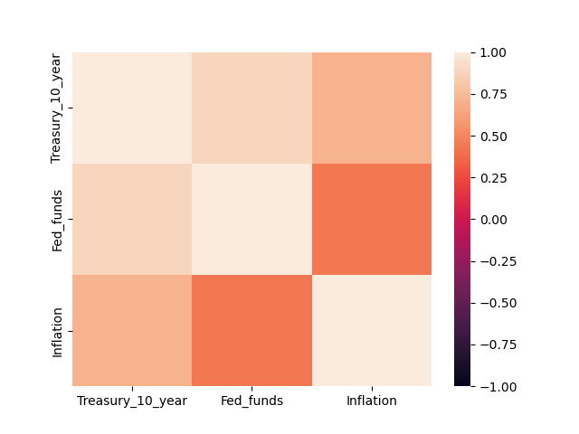 

It is seen that 10 year treasury bond interest rate is highly correlated with Fed funds interest rate, and 5-year forward inflation rate is more correlated with 10 year treasury bond interest rate rather than Fed Funds interest rate.

The relationship plots show similar relationships of 10 year treasury bond interest rate change vs 5 year forward inflation rate change vs Fed Funds interest rate change as:

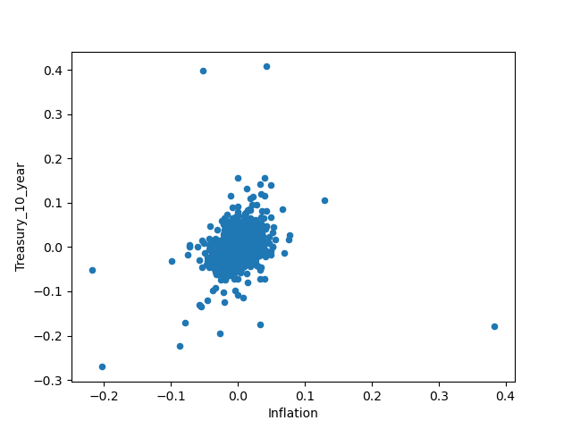 
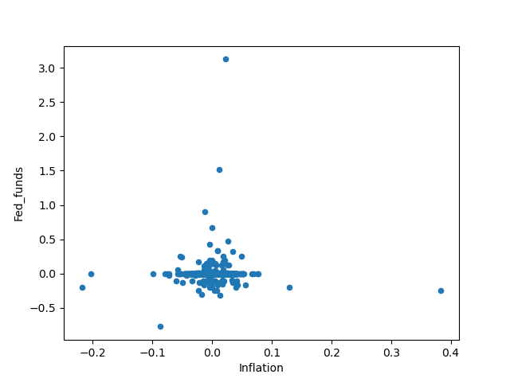 
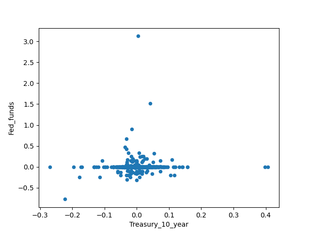 

**Question:** How does 30 Year mortgage rate, CPI, and US unemployment rate behave during 2019-2023? Are they correlated with each other?

From 2019-2023 30 Year Mortgage Rate with US Unemployment Rate and CPI Rate Figures as:
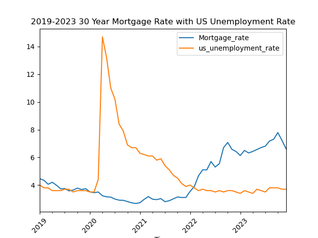 
 

It is clear that the unemployement rate rised significantly in a short period due to Covid-19 policy effect and dropped greatly after flexible Covid-19 policy adjustments, and the 30-year mortgage rate dropped to a historical low based on Fed lowering the base interest rate to almost 0 since 2020. Similarly, when Fed kept rapidly increasing policy Fed Funds rate since 2022, the 30-year mortgage rate keeps climbing until the end of 2023 while unemployment rate is kept stable with pre-Covid level in 2022-2023. In 2019-2023, US CPI rate keeps climbing up with a little dent due to Covid-19 effect in early 2020.

From relationship plots and the correlation heatmap of 30-year mortgage rate vs CPI vs US unemployment rate as:

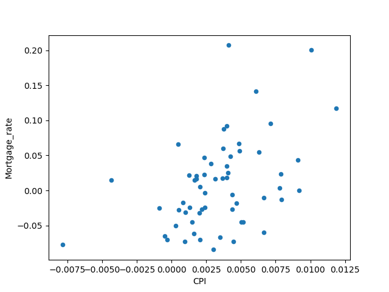 
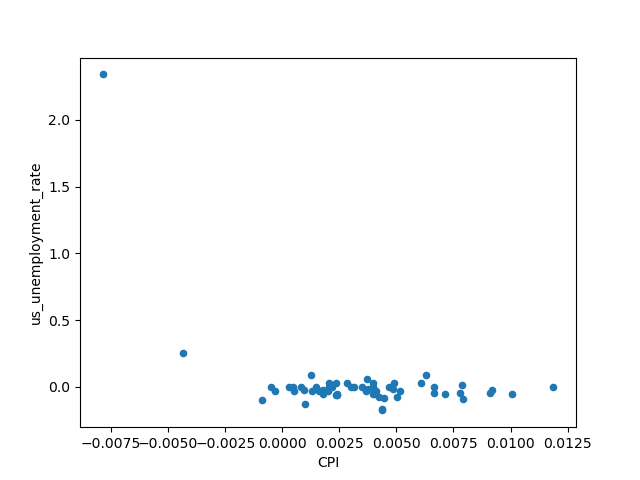
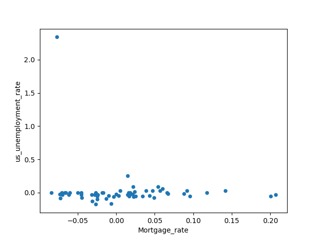 
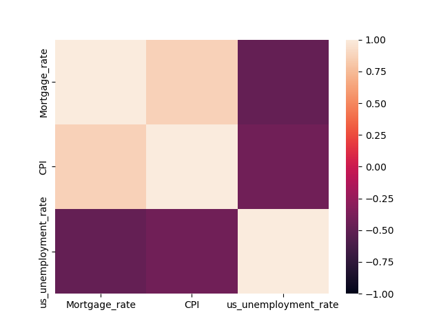

Unemployment Rate is negtively correlated with CPI and mortgage rate, and its changes were not affected by CPI or mortgage rate change. At the same period, mortgage rate with CPI has a weak correlation with their changes.

**Question:**  How does US banks index price and trading volume look like during 2019-2023? Is the US banks index price affected by interests or inflation rates?

The S&P 500 US Banks IShare Index data from 2019-2023 as:

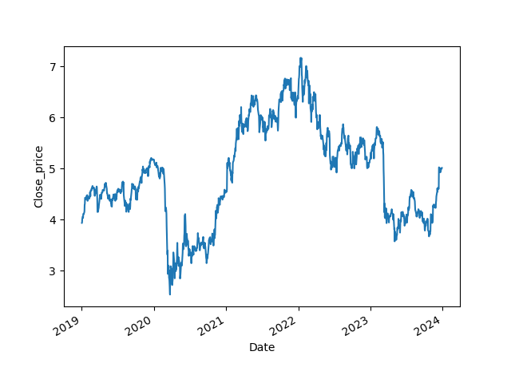
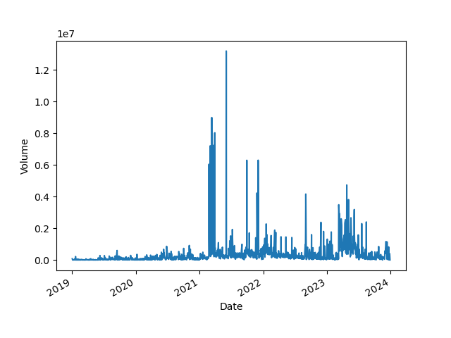

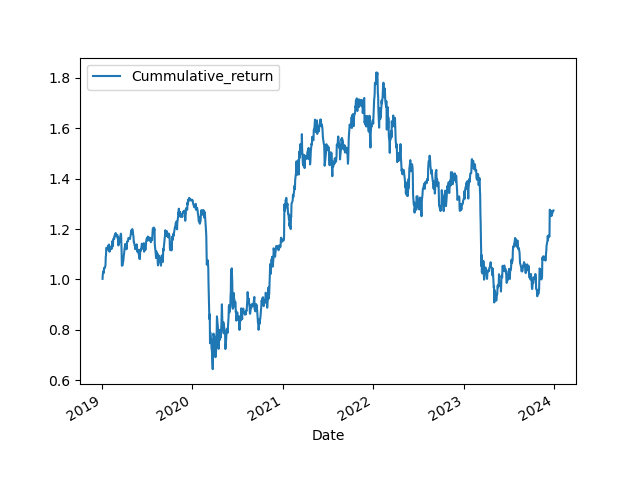

The index price and cummulative return has large drops due to Covid-19 effect as well as rapid increase in interest rate. The trading volume is relatively higher since 2021. However, the negtive impacts of Covid-19 are larger but shorter term than the rapid growing interest rates.

The following figures shows the Banks index price and cumulative returns are slightly negtively correlated with Fed funds interest rate but slightly postively correlated with inflation rate.

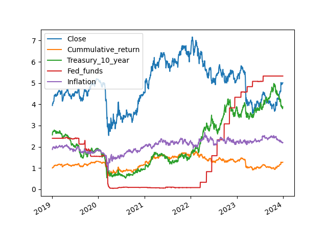
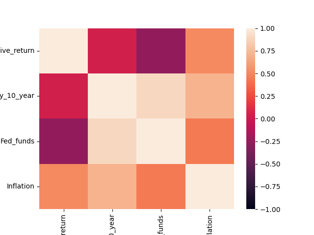

### Cash Flow Findings:

**Question:** Why was there a decline in net change in cash?

The net change in cash plot clearly illustrates a negative trend. This decline suggests a reduction in cash and cash equivalents, indicating that these banks have been spending more than they have been receiving. not excluding the impacts of the COVID-19 pandemic, Potential factors contributing to this decline could also include substantial investments, debt repayment, decreased earnings, or the impact of inflation.

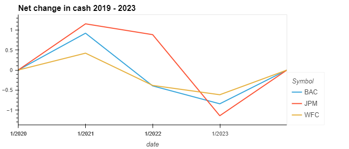

**Question:** What where the reasons for the decline in free cash flow for JPM,BAC and WFC?

When examining the free cash flow graph, a notable decline is observed for three major banks: JPM, BAC, and WFC, during the pandemic period spanning from 2019 to 2021. Particularly, JPM experienced a significant drop, reaching as low as -1.760. It is worth considering that this decline may be linked to the Federal Reserve raising key interest rates in 2021. However, the subsequent years, from 2021 to 2023, have shown a remarkable recovery for JPM, surpassing both BAC and WFC. Regardless of these fluctuations, all three banks demonstrated positive growth after the pandemic, from 2021 to 2023, with values exceeding zero, except for BAC, which remained slightly below.

**Question:** What analysis can you make on the difference between the operating cash flow and net income?

An examination of the difference between operating cash flow and net income provides additional insights. The line graph clearly depicts JPM's challenges in 2021, as evidenced by a drop to -2. This trend is also reflected in the free cash flow line graph. It is important to explore the effects of other variables, such as the sale of bank assets or significant capital expenditures, such as substantial investments which can significantly impact a bank's financial performance.

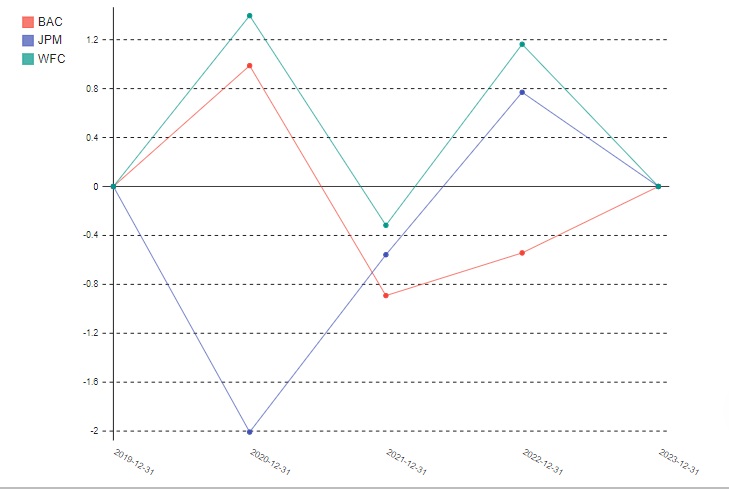

